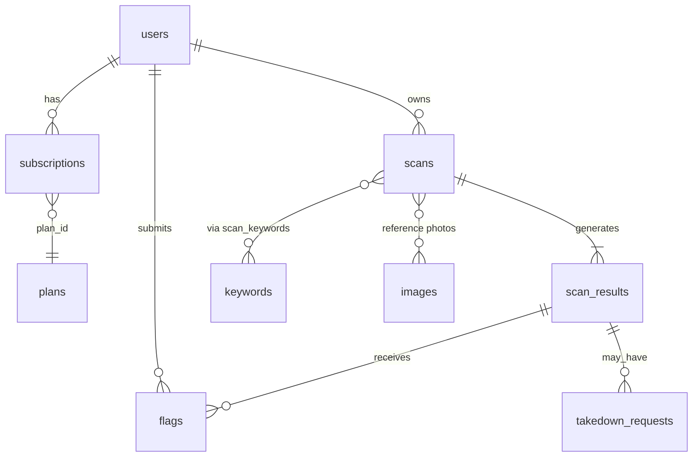

# hello

```mermaid
erDiagram
    users ||--o{ subscriptions : has
    users ||--o{ scans : owns
    users ||--o{ flags : submits
    subscriptions }o--|| plans : "plan_id"
    scans ||--|{ scan_results : generates
    scans }o--o{ keywords : "via scan_keywords"
    scans }o--o{ images : "reference photos"
    scan_results ||--o{ flags : receives
    scan_results ||--o{ takedown_requests : may_have

```
